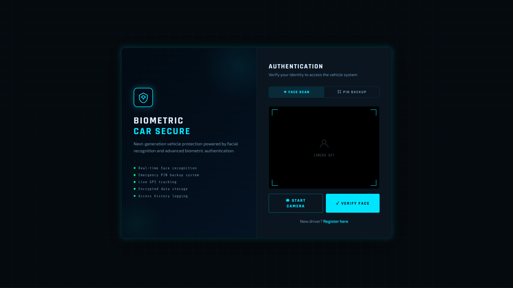

  
   
  <em>Next-generation vehicle protection powered by facial recognition</em>

# 🔐 🚗 Car Security System with Face Recognition

**A comprehensive car security system with face recognition authentication and dealership management**

---

## 📱 Authentication Methods

| Method | Description |
|--------|-------------|
| 👤 **FACE SCAN** | Primary biometric authentication |
| 🔢 **PIN BACKUP** | Emergency access with 6-digit PIN (default: 123456) |
| 🖐️ **BIOMETRIC** | Multi-factor security layer |

---

## ✨ Features

- ✅ Real-time face recognition
- ✅ Emergency PIN backup system
- ✅ Live GPS tracking
- ✅ Encrypted data storage
- ✅ Access history logging
- ✅ Owner and driver management
- ✅ One-person-one-registration policy
- ✅ Time-based access restrictions

---

## 🚀 Quick Start

### Prerequisites
- Python 3.10
- Webcam

# Create and activate virtual environment (Python 3.10)
python -m venv venv
source venv/bin/activate  # On Windows: venv\Scripts\activate

# Install dependencies
pip install opencv-python numpy insightface onnxruntime cryptography

## ✨ Features
- Face recognition car startup
- Emergency PIN backup (default: 123456)
- Owner and driver management
- One-person-one-registration policy
- Access logs and time restrictions

## 🚀 Quick Start

